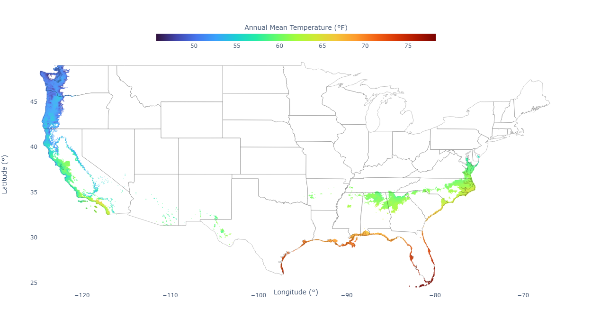
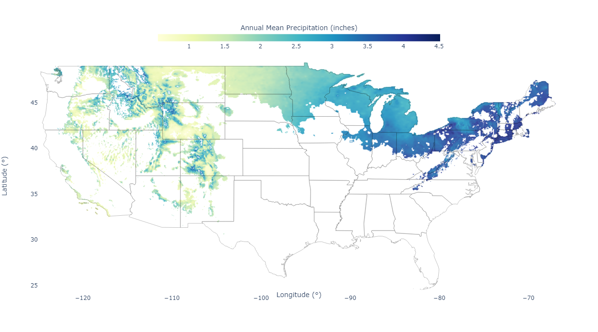
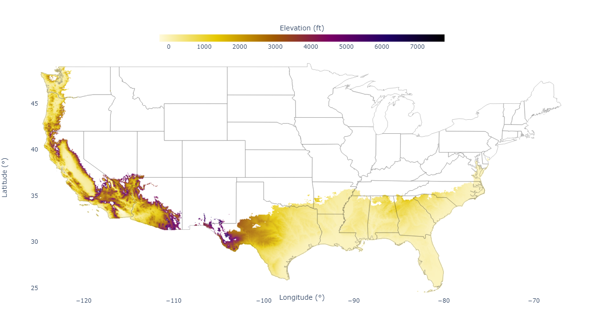

# Where is the Weather?

This repository contains a little web app for surfing desirable weather in the continental US. Initially, I was making static plots for myself and exploring where the Goldilocks Zones are, not too hot and not too cold. Then it seemed like a fun little project to make it interactive and available on the web. You can find it at [**whereistheweather.us**](http://whereistheweather.us/).

It's a little slow... but you can explore a bunch of different weather combinations. For example, if you want to know where the average temperature is *always* between 30 and 90 °F, here it is:

Want to know where the average high temperature is *always* below 85 °F and it *never* rains more than 5 inches per month? Here it is, this time mapping the precipitation rates.

What about where the average low temperature is *never* below 30 °F. Sure, here's that area, this time showing elevation.

