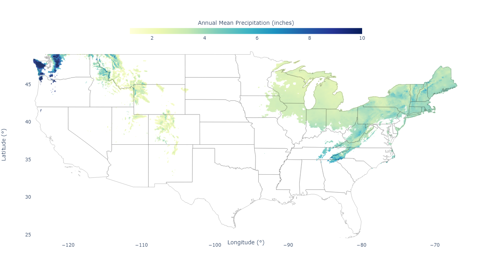
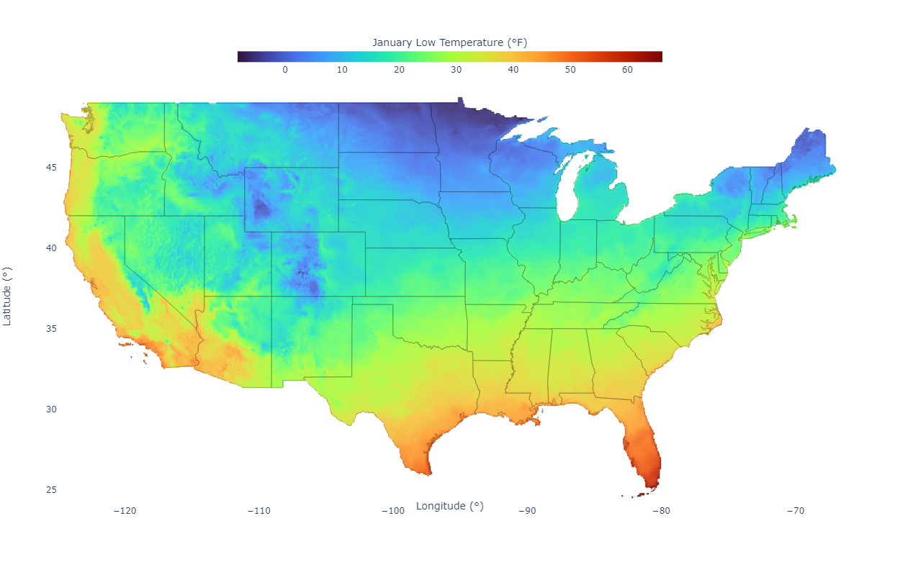

# Where is the Weather?

This repository contains a web app for surfing desirable weather in the continental US. Initially, I was making static plots for myself and exploring where the Goldilocks Zones are, not too hot and not too cold. Then it seemed like a nice little project to make it interactive and available on the web. You can find it at [**whereistheweather.us**](http://whereistheweather.us/).

For more info about the underlying data, see the [PRISM site](https://prism.oregonstate.edu/normals/). They're not exact, but it's interesting to explore the reconstructions/normals.

-----

You can see where the average low temperature, average high temperature, and average monthly precipitation are within whatever ranges you choose. Then you can display different data within these zones: elevation, monthly temperatures (high, low, mean), and pecipitation.

For example, if you want to know where the average temperature is *always* between 30 and 90 °F, here it is:

Want to know where the average high temperature is *always* below 85 °F and there's at least 1 inch of precipitation every month? Here it is, this time mapping the precipitation rates.

What about where the average low temperature is *never* below 30 °F. Sure, here's that area, this time showing elevation.

You could also use the map to look at the climate normals. For example, without restricting any of the ranges, you can choose to display the low temperatures for January, which shows how cold it gets every night around northern Minnesota.

